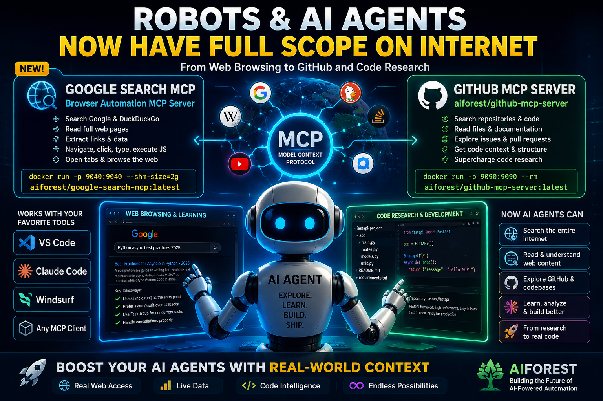

# Google Search MCP — Browser Automation Server

<p align="center">
  
</p>

> **Author:** Babak Emami (Babak EA) — emami.babak@gmail.com  
> **License:** MIT — see [LICENSE](LICENSE)  
> If you fork or distribute this project, you **must** keep the original author's name and project attribution.

---

A browser automation MCP server that gives AI agents real web access through Chrome.

It allows MCP-capable clients like **Claude Desktop**, **Copilot**, **Windsurf**, and custom agents to:

✅ Search Google & DuckDuckGo  
✅ Open and read full web pages  
✅ Extract links and structured results  
✅ Click, type, navigate, switch tabs  
✅ Execute JavaScript inside the browser  
✅ Run fully through Docker or local Python  

---

> *The idea was simple:*
>
> *LLMs already have intelligence. What they often lack is reliable "eyes and hands" inside a real browser.*
>
> *So I built an MCP server that focuses purely on browser capability — while remaining model-agnostic.*  
> *No bundled LLM. No vendor lock-in. Just a clean browser automation layer for modern AI agents.*

---

One of the best parts: you can literally ask an AI client —

> **"Search Google for Python async best practices and summarize the top result."**

…and the agent autonomously:

1. Launches Chrome
2. Searches Google
3. Opens the result
4. Reads the page
5. Summarises it

---

## Tech Stack

| Layer | Technology |
|-------|-----------|
| Protocol | MCP (Model Context Protocol) |
| Browser | Selenium + Chrome |
| Container | Docker |
| Language | Python |
| Integrations | Claude Desktop · GitHub Copilot · Windsurf |

---

## Quick Docker Start

```bash
docker run -p 9040:9040 --shm-size=2g aiforest/google-search-mcp:latest
```

---

A **Model Context Protocol (MCP) server** that gives any MCP-capable AI client (Claude Desktop, custom agents, etc.) a real Chrome browser to:

- Navigate any URL
- Read the full text of any web page (scrolling, expanding collapsed sections)
- Search Google or DuckDuckGo and return structured results
- Open links in new tabs and read them
- Click elements, type into inputs, press keys
- Extract all hyperlinks from a page
- Run arbitrary JavaScript

**No LLM is bundled.** Your MCP client provides the intelligence — this server provides the eyes and hands in the browser.


---

## Quick start (Docker — recommended)

```bash
# 1. Pull from Docker Hub
docker run -p 9040:9040 --shm-size=2g aiforest/google-search-mcp:latest

# 2. Add to Claude Desktop  (~/.config/claude/claude_desktop_config.json)
{
  "mcpServers": {
    "google-search": {
      "url": "http://localhost:9040/mcp"
    }
  }
}


```

That's it. Ask Claude "search Google for …" or "open https://example.com and summarise it".

---

## Build from source

### Prerequisites

- Docker Desktop (or Docker Engine on Linux)
- Git

### Clone & build

```bash
git clone https://github.com/babakea/google-search-mcp.git
cd google-search-mcp

# Build
./build_and_push.sh

# Run
docker run --rm -p 9040:9040 --shm-size=2g yourdockerhubuser/google-search-mcp:latest
```

### Build + push to Docker Hub

```bash
DOCKER_USER=yourdockerhubname ./build_and_push.sh --push
```

---

## Local (no Docker)

```bash
pip install -r requirements_mcp.txt

# stdio transport — for Claude Desktop direct integration
python mcp_server.py

# HTTP transport — for network / multi-client use
MCP_TRANSPORT=http MCP_PORT=9040 python mcp_server.py
```

---

## MCP Tools

| Tool | Description |
|---|---|
| `browser_launch` | Start a headless Chrome (required before any other tool in Docker) |
| `browser_connect` | Attach to a visible Chrome started with `--remote-debugging-port` |
| `browser_status` | Is the browser connected? What tab is active? |
| `browser_close` | Close the browser session |
| `browser_list_tabs` | List all open tabs |
| `browser_switch_tab` | Switch to a tab by index |
| `browser_close_tab` | Close the current tab |
| `browser_navigate` | Go to a URL |
| `browser_open_new_tab` | Open a URL in a new tab |
| `browser_go_back` | Press the Back button |
| `browser_read_page` | Full page text extraction (scroll + expand) |
| `browser_get_page_links` | List all hyperlinks on the page |
| `browser_open_and_read` | Open URL in new tab + read text in one call |
| `browser_click` | Click an element by CSS selector |
| `browser_click_xpath` | Click an element by XPath |
| `browser_type` | Type into an input / textarea |
| `browser_press_key` | Send ENTER, TAB, ESCAPE, etc. to an element |
| `browser_execute_js` | Run arbitrary JavaScript |
| `browser_google_search` | Search Google → titles, URLs, snippets |
| `browser_ddg_search` | Search DuckDuckGo (fallback) |
| `browser_search_and_read` | Search → open result → return full page text |

---

## Configuration

| Environment variable | Default | Description |
|---|---|---|
| `MCP_TRANSPORT` | `stdio` | `stdio` for Claude Desktop, `http` for Docker/network |
| `MCP_HOST` | `0.0.0.0` | Bind address (HTTP mode) |
| `MCP_PORT` | `9040` | Port (HTTP mode) |

Override at runtime:
```bash
docker run -p 9040:9040 --shm-size=2g \
  -e MCP_PORT=9040 \
  aiforest/google-search-mcp:latest
```

Override at build time:
```bash
docker build --build-arg MCP_PORT=9040 -t google-search-mcp .
```

---

## Project structure

```
.
├── mcp_server.py          # MCP server — all tools
├── browser_automation.py  # BrowserManager (Selenium wrapper)
├── api_gateway.py         # Optional FastAPI REST gateway (port 9041)
├── llm_client.py          # Optional LiteLLM client (for non-MCP callers)
├── requirements_mcp.txt   # MCP + Selenium only (no LLM)
├── requirements.txt       # Full local dev requirements
├── Dockerfile             # Chrome + Selenium + MCP server
├── docker-compose.yml     # One-command deployment
├── build_and_push.sh      # Build & push to Docker Hub
├── search_babak_ea.sh     # CLI: search Google for "Babak EA github"
├── .vscode/
│   └── mcp.json           # VS Code / GitHub Copilot MCP config
├── .windsurf/
│   └── mcp.json           # Windsurf MCP config
└── LICENSE                # MIT License
```

---

## Example conversation with Claude Desktop

> **You:** Search Google for "Python async best practices 2025" and summarise the top result.

Claude will call:
1. `browser_launch` → starts headless Chrome
2. `browser_google_search` → returns top results
3. `browser_open_and_read` → opens the top link, reads the full page
4. Summarises it for you

---

## Editor integration

Make sure the Docker container is running first:
```bash
docker run -d -p 9040:9040 --shm-size=2g babakea/google-search-mcp:latest
```

### VS Code (GitHub Copilot)

The repo already includes a ready-to-use [.vscode/mcp.json](.vscode/mcp.json).  
Open the project in VS Code — Copilot will detect the server automatically.

To add it manually, create or update `.vscode/mcp.json`:
```json
{
  "servers": {
    "google-search-mcp": {
      "type": "http",
      "url": "http://localhost:9040/mcp"
    }
  }
}
```

**stdio mode (local Python, no Docker):**
```json
{
  "servers": {
    "google-search-mcp": {
      "type": "stdio",
      "command": "python",
      "args": ["${workspaceFolder}/mcp_server.py"]
    }
  }
}
```

---

### Windsurf

The repo includes [.windsurf/mcp.json](.windsurf/mcp.json).  
Windsurf detects it automatically when you open the project.

To add it to your **global** Windsurf config (`~/.codeium/windsurf/mcp_config.json`):
```json
{
  "mcpServers": {
    "google-search-mcp": {
      "serverUrl": "http://localhost:9040/mcp",
      "disabled": false
    }
  }
}
```

**stdio mode (local Python, no Docker):**
```json
{
  "mcpServers": {
    "google-search-mcp": {
      "command": "python",
      "args": ["/absolute/path/to/mcp_server.py"],
      "disabled": false
    }
  }
}
```

---

### Claude Desktop

Edit `~/Library/Application Support/Claude/claude_desktop_config.json` (macOS)  
or `%APPDATA%\Claude\claude_desktop_config.json` (Windows):
```json
{
  "mcpServers": {
    "google-search-mcp": {
      "url": "http://localhost:9040/mcp"
    }
  }
}

```

---

## Contributing

Contributions are welcome!  
Please keep the original author attribution (Babak Emami / Babak EA) in the LICENSE and README as required by the MIT License terms.

1. Fork the repo
2. Create a feature branch: `git checkout -b feature/my-feature`
3. Commit your changes
4. Open a Pull Request

---

## License

MIT License © 2026 **Babak Emami (Babak EA)**

See [LICENSE](LICENSE) for full text.  
Any fork or redistribution **must** retain the original copyright notice and author attribution.
